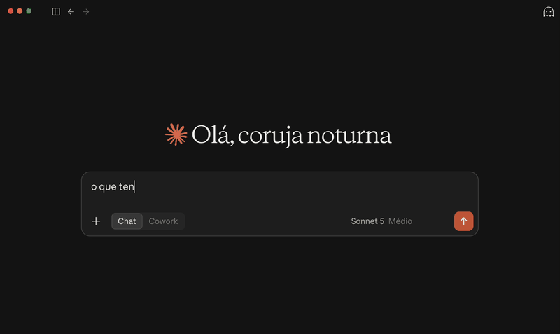

# finance-mcp

> Status: as 5 tools da Fase 1 estão implementadas, validadas e
> documentadas — ver "Definição de done" no plano de portfólio.



## O que é

Um servidor MCP (Model Context Protocol) de finanças pessoais, sobre
SQLite, com dados fictícios (seed). Expõe 5 tools para consulta financeira
via qualquer cliente MCP (ex.: Claude Desktop).

## Que problema resolve

Servir de referência pública, bem documentada em português, de como
desenhar um servidor MCP — em particular, como desenhar assinaturas de
tools que um modelo consegue usar sem ambiguidade. Servidores MCP bem
documentados em português ainda são raros.

## Como rodar

```bash
npm install
npm run seed   # cria finance.db com schema + dados fictícios
npm run dev    # inicia o servidor via stdio
```

Configuração no Claude Desktop: adicionar este servidor ao
`claude_desktop_config.json` apontando para `npm run dev` ou para o build
em `dist/index.js` (`npm run build && npm start`).

## Decisões técnicas

- **TypeScript + SDK oficial do MCP**: transporte stdio, é o caminho mais
  direto e mais documentado pelo protocolo.
- **SQLite (better-sqlite3)**: zero infraestrutura, API síncrona simples,
  suficiente para um dataset fictício de finanças pessoais.
- **Dados fictícios via seed script**: repositório público não pode
  conter dados financeiros reais de ninguém.

## Tools (Fase 1)

| Tool | Entrada | Retorno | Status |
|---|---|---|---|
| `get_saldo` | conta (opcional) | saldo atual por conta | ✅ implementada |
| `gastos_por_categoria` | período, conta (opcional) | totais agregados | ✅ implementada |
| `contas_a_pagar` | janela de dias | pendências com vencimento | ✅ implementada |
| `buscar_transacoes` | texto, período, faixa de valor | lista paginada | ✅ implementada |
| `resumo_fatura` | cartão, mês de referência | fechamento, vencimento, total | ✅ implementada |

`get_saldo` aceita um parâmetro opcional `conta` (nome exato). Sem ele,
retorna o saldo de todas as contas cadastradas. O saldo é `saldo_inicial`
mais a soma das transações não pendentes da conta — transações pendentes
(contas a pagar em aberto) não entram no cálculo.

`gastos_por_categoria` recebe `data_inicio` e `data_fim` (formato
`YYYY-MM-DD`, ambos inclusive) e um `conta` opcional. Retorna o total
gasto em cada categoria no período — só gastos efetivados (valor
negativo, não pendentes) entram na soma; receitas e pendências ficam de
fora. Gastos sem categoria aparecem agrupados como "Sem categoria".

`contas_a_pagar` recebe `janela_dias` (inteiro positivo, obrigatório) e
retorna as transações pendentes (`pendente = 1`) com vencimento entre
hoje e hoje + `janela_dias` dias, ambos inclusive, ordenadas por
vencimento crescente. "Hoje" é a data real do sistema no momento da
chamada — não um valor fixo. Pendências já vencidas (vencimento anterior
a hoje) e transações já efetivadas não entram no resultado.

`buscar_transacoes` aceita `texto` (substring na descrição,
case-insensitive), `data_inicio`/`data_fim` e `valor_min`/`valor_max` —
todos opcionais e combináveis (E lógico). Sem nenhum filtro, retorna
todas as transações, mais recentes primeiro. Resultado paginado via
`pagina` (1-indexada, default 1) e `tamanho_pagina` (default 20, máximo
100); a resposta inclui o total de resultados antes da paginação, para
o cliente saber se há mais páginas.

`resumo_fatura` recebe `cartao` (nome exato de uma conta do tipo cartão
de crédito) e `mes_referencia` (formato `YYYY-MM`, o mês em que a
fatura **fecha** — não necessariamente o mês das transações). Retorna
`fechamento`, `vencimento` (pode cair no mês seguinte ao fechamento) e
`total` — a soma dos gastos da conta entre o fechamento anterior
(exclusive) e o fechamento do mês pedido (inclusive). Cada conta do tipo
cartão tem `dia_fechamento`/`dia_vencimento` próprios, configurados no
cadastro da conta.

## O que ficou de fora (e por quê)

- **Autenticação multi-tenant** — fora de escopo: este é um servidor de
  demonstração de uso único, não um produto multiusuário.
- **Deploy** — fora de escopo: o objetivo é rodar localmente via stdio.
- **Integração com API financeira real** — fora de escopo: dados são
  fictícios de propósito, para poder ser público.
- **Escrita de dados** (criar/editar transações) — fora de escopo: as 5
  tools são somente leitura.

Itens que surgirem além destes vão para o `backlog.md` do portfólio, não
para este projeto.

---

## Licença

MIT — ver [LICENSE](./LICENSE).
